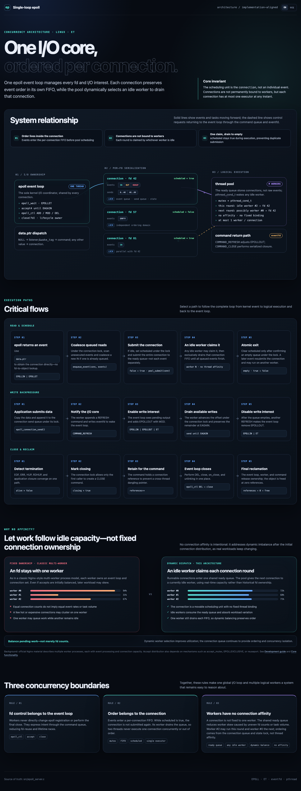

# Fast In Balance

[English](README.md) | [简体中文](README.zh-CN.md)

A Linux C11 networking library built around one edge-triggered epoll event loop and a logical worker pool. Connections are the scheduling unit: each connection owns an ordered event queue, while any idle worker may execute it without a fixed connection-to-thread binding.

[](docs/architecture.html)

_Click the complete diagram to open the interactive, bilingual architecture document._

## Design

- The listening fd is registered with `epoll_event.data.ptr == NULL`. Once accepted, each fd is wrapped in an `epoll_connection`, and subsequent events carry a direct pointer to that object.
- Every connection owns a mutex, a FIFO event queue, and a pending-send queue.
- Accepted connections register `EPOLLIN`, `EPOLLPRI`, `EPOLLERR`, `EPOLLHUP`, and `EPOLLRDHUP` in ET mode. The event loop owns event collection, every `epoll_ctl` operation, and final fd closure.
- A connection is submitted to the worker pool only when its first queued event changes it from idle to scheduled. One worker drains all events for that connection in FIFO order.
- Connections have no worker affinity. Each scheduling round may be handled by any idle worker, balancing actual task load instead of only fd counts.
- A single connection is never executed by multiple workers concurrently. The connection mutex and `scheduled` state preserve ordering without fixed thread binding.
- ET reads continue until `EAGAIN`. Writes continue until the send queue is empty or the socket returns `EAGAIN`; `EPOLLOUT` is enabled only while buffered output remains.
- When no output is pending, `epoll_connection_send` first attempts a direct send. Queued output can be flushed with either `write` or configurable `writev` batching (`use_writev`).
- If an unexecuted read event already exists in a connection queue, another read event is coalesced. A read currently being executed does not count as queued, preventing an edge from being lost around the final `recv(...)=EAGAIN` boundary.
- Workers return write-interest updates and close requests to the event loop through a command queue and `eventfd`. Reference counting protects connection lifetime across threads.

## Build and run

```sh
make
./c/echo_server 9000
```

From another terminal:

```sh
printf 'hello\n' | nc 127.0.0.1 9000
```

Run the concurrent integration test:

```sh
make test
```

## Go implementation

The matching Go implementation lives in [`go/`](go/README.zh-CN.md). It includes
the public API, TCP, UDP, TLS, HTTP (HTTP/1.1 and HTTP/2) and WebSocket echo server and client
examples, and concurrent backpressure tests for
both the regular `write` and batched `writev` paths. It has native backends on
Linux (epoll), macOS (kqueue) and Windows (IOCP); other systems use a portable
backend that preserves connection-level FIFO scheduling:

```sh
make go
make go-test
```

The public API is in [`c/include/epoll_server.h`](c/include/epoll_server.h). Regular
input invokes `on_data`; out-of-band input raised by `EPOLLPRI` and read with
`MSG_OOB` invokes `on_priority_data`. Both run on the logical worker currently
executing that connection; they may parse the protocol and call
`epoll_connection_send`. The send function copies its input, so the caller may
immediately reuse the original buffer.

## Architecture document

Open [`docs/architecture.html`](docs/architecture.html) for the bilingual relationship diagram and the read scheduling, write backpressure, dynamic load balancing, and close/reclamation flows. English is selected by default.
