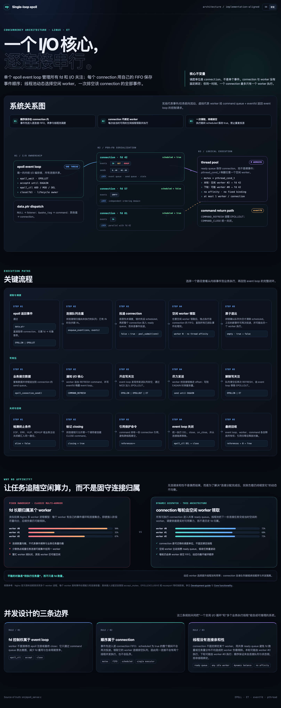

# 单 Event Loop epoll 网络库

[English](README.md) | [简体中文](README.zh-CN.md)

一个 Linux C11 网络库，采用单个 edge-triggered epoll event loop 和逻辑线程池。connection 是调度单位：每个 connection 自己维护有序事件队列，同时可以由任意空闲 worker 执行，不与固定线程绑定。

[](docs/architecture.html)

_点击完整架构与流程图可打开支持中英文切换的交互架构文档。_

## 设计

- 监听 fd 注册时 `epoll_event.data.ptr == NULL`；连接建立后创建 `epoll_connection`，后续事件的 `data.ptr` 直接指向该结构。
- 每个连接拥有 mutex、FIFO 事件队列和待发送数据队列。
- event loop 负责 accept、收集读/写/错误事件，以及全部 `epoll_ctl` 操作和最终 fd 关闭。
- 首个事件使 connection 从空闲变为已调度时，才把 connection 投递到线程池。一个 worker 按 FIFO 顺序排空该 connection 的全部事件。
- connection 与 worker 没有亲和性。每轮可由任意空闲 worker 执行，平衡的是实际任务量，而不只是 fd 数量。
- 同一个 connection 不会同时被多个 worker 执行。connection mutex 和 `scheduled` 状态在不绑定固定线程的情况下保证事件顺序。
- ET 读循环持续到 `EAGAIN`；写循环持续到队列清空或 `EAGAIN`。仅在存在待发送数据时注册 `EPOLLOUT`，清空后移除。
- 若连接队列中已有尚未执行的读事件，新读事件会被合并。正在执行的读事件不算“尚未执行”，避免在最后一次 `recv(...)=EAGAIN` 的边界丢失新 edge。
- worker 通过 command queue 和 `eventfd` 将写关注更新和关闭请求送回 event loop；引用计数保护跨线程 connection 生命周期。

## 构建和运行

```sh
make
./echo_server 9000
```

另一个终端可执行：

```sh
printf 'hello\n' | nc 127.0.0.1 9000
```

运行并发集成测试：

```sh
make test
```

公共接口位于 [`include/epoll_server.h`](include/epoll_server.h)。`on_data` 在当前执行该 connection 的逻辑 worker 上调用，可解析协议并调用 `epoll_connection_send`；发送函数会复制传入数据，因此回调返回后原缓冲区可立即复用。

## 架构文档

打开 [`docs/architecture.html`](docs/architecture.html) 可查看支持中英文切换的系统关系图，以及读取调度、写背压、动态负载均衡和关闭回收流程。页面默认显示英文。
